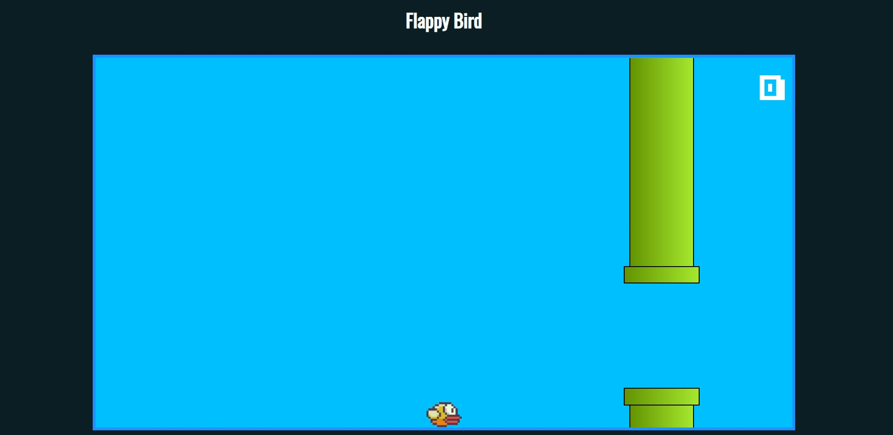

# FlappyBirdJS

Nesse projeto foi construido uma versão do famoso jogo Flappy bird , onde foi utilizado  as seguintes os tecnologias:

+ HTML
+ CSS
+ JavaScript

A interfface  é intuitiva onde  é necessário apenas clicar alguma tecla  do teclado para que o passarinho suba um pouco a cada  movimento de pressionar o teclado, sendo o objetivo do jogo alcançar a  maior  pontuação possível sem tocar os canos. É possivel observar o placa no canto superior direito da tela.

#### Interface quando possui apenas uma foto 

